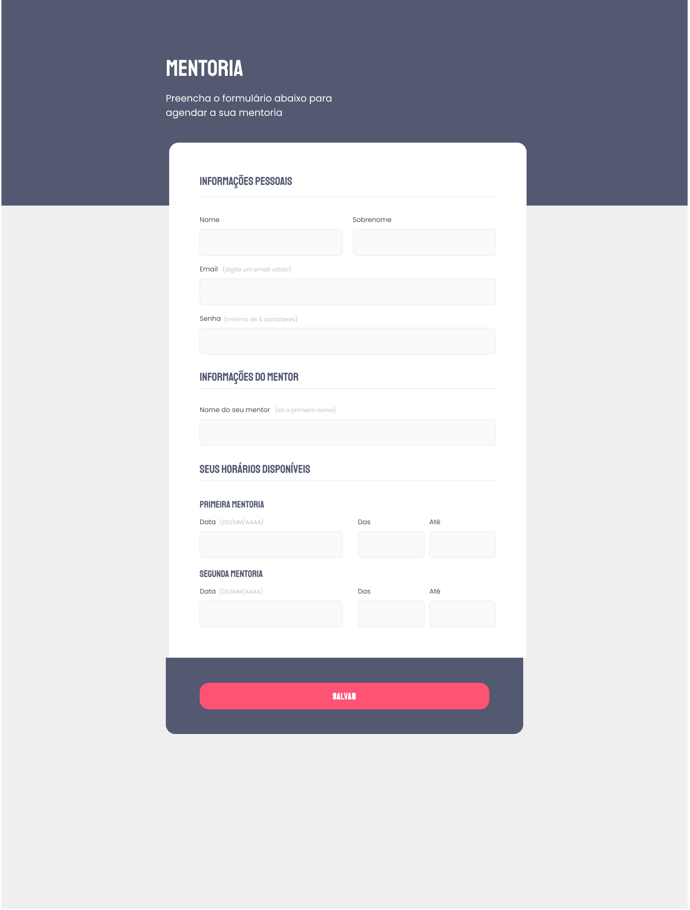

 

## 🚀 Tecnologias
Esse projeto foi desenvolvido durante o NLW da Rocketseat com as seguintes tecnologias:

- HTML
- CSS
- Git e Github

## 🏷️ Layout
Você pode visualizar o layoout do projeto através
[desse link](https://www.figma.com/file/7EZcvEtVsZCfqBGL8KCV1X/Stage-03---Formul%C3%A1rio-intermedi%C3%A1rio-(Copy)?type=design&node-id=0-1&mode=design&t=DG1coCuNt5B2jegD-0).
É necessário ter uma conta no [Figma](https://www.figma.com)